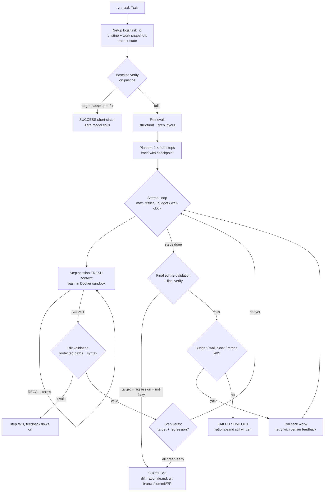

# Harness Architecture (Terminal 1 — `harness/`)

This document explains how the harness module works — the core agent
loop, retry/repair logic, structured state, and context retrieval —
well enough to understand and reason about the system without reading
every file. Contracts with the other three modules live in
[`INTERFACES.md`](../INTERFACES.md); per-round build history lives in
[`harness/AGENTS.md`](../harness/AGENTS.md).

## What the harness is

Given a `Task` — `{task_id, repo_path, issue_text, config}` — the
harness produces a `TaskResult` with a fix for the bug described in
`issue_text`, **or an honest failure**. The single entry point is:

```python
harness.core.run_task(task: Task, log_root: Path | None = None) -> TaskResult
```

Three properties define the design:

1. **The original repo is never touched.** Every run works on private
   snapshots under `logs/{task_id}/` (`pristine/` + `work/`). Diffs,
   git output, and rollback all happen in that private tree.
2. **Completion is verifier-gated.** `status="success"` requires the
   target test to pass AND the full suite to show no regressions AND a
   flake check — never the model's own claim that it fixed the bug.
3. **Everything is observable.** Every prompt, model reply, command,
   output, verify, and decision lands in an append-only `trace.jsonl`,
   and a compacted `state.json` is the progress authority for other
   modules (CLI, dashboard, resume, memory ingestion).

## The core loop (one task)

```
 run_task(task)
 │
 ├─ 1. SETUP  logs/{task_id}/
 │     ├─ pristine/   ← snapshot of the original repo (never re-snapshotted)
 │     ├─ work/       ← the agent's copy; ALL edits land here
 │     ├─ trace.jsonl  (append-only, every event)
 │     └─ state.json   (compacted progress view, atomic rewrite)
 │
 ├─ 2. BASELINE VERIFY (pristine copy)
 │     target already passes? → short-circuit SUCCESS, zero model calls
 │
 ├─ 3. RETRIEVAL  (issue text → curated file list; see below)
 │
 ├─ 4. PLAN      model decomposes the issue into 2–4 sub-steps,
 │                each with a pass/fail checkpoint (never one-shot)
 │                → logs/{task_id}/plan.json
 │
 ├─ 5. ATTEMPT LOOP  (up to max_retries, budget & wall-clock capped)
 │   │
 │   ├─ per step, in a FRESH session (deliberate context reset):
 │   │    model ──bash command──▶ Docker sandbox (work/ bind-mounted)
 │   │      ▲ output + constraint re-injection (issue one-liner,
 │   │      │ current step, remaining steps, protected paths)
 │   │      ├─ RECALL <terms> → grep trace.jsonl, re-inject old detail
 │   │      └─ SUBMIT → validate edits → verify → step done?
 │   │
 │   ├─ early verifier exit: target+regression green mid-plan → done
 │   │
 │   ├─ attempt ended unverified? → final edit re-validation,
 │   │    rollback work/, retry with verifier feedback as the
 │   │    next attempt's opening message
 │   └─
 │
 └─ 6. OUTCOME
       ├─ success (verifier-gated): diff + rationale.md +
       │    git branch/commit/PR description (private work copy)
       │    + state.json completed
       └─ failed/timeout/error: rationale.md still written;
            unverified diffs NEVER get git output
```

The same flow as a Mermaid diagram (render on GitHub):



### The step session (where the agent actually works)

Each planner sub-step runs in its own **fresh** model session — a
deliberate context reset (spec item 12): completed steps are handed
over *structurally* (as a checklist in the system prompt), not as
stale chat history. The session is bash-only (mini-swe-agent style):
one command per turn, executed in the Docker sandbox against `work/`,
output capped (`max_output_chars`). Two escape hatches:

- **`SUBMIT`** — the model declares the step done. The harness then
  validates its edits (protected paths, Python syntax) and runs the
  step's verify. SUBMIT never ends the *task*, only the step.
- **`RECALL <terms>`** — the model asks for older compacted-away detail
  (e.g. output from step 1's session). The harness greps this task's
  `trace.jsonl` and re-injects the matches as the next user message
  (budgeted: `max_recalls_per_step` etc. — see config). This is what
  makes compaction *reversible*: state.json is the compacted view,
  trace.jsonl keeps full fidelity, RECALL is the retrieval hook between
  them.

A deny-pattern guard rejects catastrophically-shaped commands
(`rm -rf /` and friends, `curl | bash`, fork bombs, mkfs…) with a
`COMMAND REJECTED` nudge rather than executing them.

## Retry / repair logic

Failure feedback flows through two loops, both landing in the
**`last_feedback`** seam — a plain string that becomes the next
session's opening message:

- **Step → step (intra-attempt):** each step session receives the
  prior step's checkpoint status; a failed step ends the *attempt*
  (later steps depend on it) with the verifier's raw output tail —
  not just "it failed".
- **Attempt → attempt (retry loop):** when an attempt ends without a
  verified fix, `work/` is rolled back to `pristine/`, completed steps
  are reset, and the next attempt opens with the accumulated
  feedback (why the target still fails / what regressed / what the
  verifier actually printed).

Retry is deliberately *naive-with-rich-feedback* — there is no
failure-classification engine choosing repair strategies (a documented
scope decision; the `last_feedback` seam is where spec items 24/25
could plug in). Three config-driven stopping conditions are checked at
every iteration and mid-step: `max_retries`, `budget_cap_usd`,
`max_wallclock_s`.

Two extra guarantees worth knowing:

- **Final edit re-validation:** before the final verify can mint a
  success, edits are re-checked against the protected-path policy. A
  step that violated policy (e.g. forged `.git/`, defused a test) but
  happened to leave the suite green is rejected — validation is a
  policy gate, not a hypothesis the verifier re-litigates.
- **Pre-passing pristine short-circuit:** if the target test already
  passes on the *pristine* copy, the task returns success with zero
  model calls (mislabeled tasks can't burn budget).

### Resume (crash recovery)

`run_task` is what a scheduler kills and relaunches. When
`task.config["resume"]` is truthy and the prior run left a state.json
with completed steps plus a `plan.json`, the relaunch **continues**
instead of restarting: the persisted plan is reused (re-planning could
orphan recorded step descriptions), completed steps are skipped, the
surviving `work/` copy's partial edits are built upon, and the
in-flight attempt + spent budget continue (a crash is an
interruption, not a verification failure — it consumes no retry slot).
`trace.jsonl` is appended to across relaunches, so pre-kill history
survives as first-class data. Unreadable/missing resume state degrades
to a fresh start (`resume_aborted` trace event), never a crash.

## The structured state file (`state.json`)

`logs/{task_id}/state.json` is the Boundary-4 contract — the compacted
progress view that other modules read:

```json
{
  "task_id": "...",
  "plan": ["1. Locate the off-by-one in parse()", ...],
  "completed_steps": ["1. ..."],
  "files_touched": ["numlib/parser.py"],
  "decisions": ["fix verified by test suite (target + regression)", ...],
  "remaining_plan": ["2. ..."],
  "phase": "editing"
}
```

Rules that hold by construction (and regression tests):

- Rewritten whole on every update via an atomic tmp-file + rename —
  never a torn read; exact key order.
- `files_touched` lists a file only *after* its edits pass validation;
  `completed_steps` resets on attempt rollback — `remaining_plan` is
  the reliable progress signal.
- On a verified success, every plan step that *ran* in the winning
  attempt is recorded completed (a step can exhaust turns after its
  commands already made the fix; the verified diff subsumes its work).
- Terminal 4's memory auto-ingests the `decisions` field across tasks
  — it's the cross-task/cross-agent memory feed.

Alongside it, `trace.jsonl` (append-only) records every event with
full fidelity — prompts, replies, tool calls/results, verifies,
decisions, recalls, retries, state transitions — and `plan.json` is
harness-internal bookkeeping (steps + in-flight attempt + spent cost)
that makes resume well-defined. `transitions.jsonl` is the compact
state-transition audit trail (see the state-machine section). State/
trace/plan/transitions live together in `logs/{task_id}/`.

## Retrieval strategy (issue → context)

Retrieval runs once per task, before planning, and produces a small
curated file list (capped by `context_files_cap` / `context_lines_cap`)
injected into the planner and step prompts. Two layers, merged into
one ranking:

1. **Structural layer** (primary, when available): consumes Terminal
   4's tree-sitter code graph and locates the bug through the repo's
   *actual* structure:
   - **Target-test anchor** — the failing test's file → its imports →
     the module under test; its calls → the symbols it exercises.
     Finds the right files even when the issue text names *nothing*.
   - **Subword symbol matching** — `compute_monthly_total` decomposes
     to {compute, monthly, total}, so "monthly total is doubled"
     matches without the identifier appearing in the issue.
   - **Call-graph neighborhood** — matched symbols expand one hop to
     callers/callees (the failing test is the caller; the defect is
     often a callee).
   - The index lives at `logs/_code-graph/` — shared across tasks,
     outside the original repo (which is never mutated).
2. **Grep layer** (fallback, always available): term extraction from
   the issue text, file scoring by path/content hits. Any structural
   failure degrades to grep-only with a `strategy: "grep"` note —
   retrieval must not kill a task run.

The chosen strategy is recorded in a `retrieval` trace event and
stated in the planner prompt. Known gap (documented): matching is
keyword/subword, not semantic — "average" vs `mean()` needs an
embedding index (future seam).

### Dynamic context budgets + per-step re-ranking (Round 8)

How MUCH context those layers contribute is sized by real signals, not
a flat budget (`retrieval.size_context_budget`):

- **Signals**: issue text length (one-liner → less; multi-paragraph
  report → more), repo size (candidate file count), and files already
  touched this task (an agent three files deep needs MORE context to
  keep the whole fix coherent — the budget grows mid-task). Each
  signal contributes a bounded adjustment; the result is clamped, and
  the task-config caps (`context_files_cap` / `context_lines_cap`)
  remain the hard ceiling. The decision is recorded in a
  `context_budget` trace event.

- **Re-ranking per sub-step** (`retrieval.rerank_files`): the initial
  ranking is computed against the whole issue; each step's context is
  then re-ranked against that step's OWN description / checkpoint /
  `files_hint` — a step three steps in often needs different context
  than the start. Planner hints still lead; re-ranking re-orders and
  never drops candidates (the retrieval safety net survives).

## Coordinated multi-file changes (Improvement Round 2)

Some fixes cannot land one file at a time: a signature change breaks
every call site, a rename breaks every caller, a field rename breaks
the model's serializers. The harness treats such changes as ONE atomic
unit:

1. **Detection** (`harness/coordination.py`, planning time): from the
   files retrieval ranked, the structural graph is walked OUTWARD —
   every caller of a symbol defined in those files (call edges) plus
   every importer of those modules (import edges). The issue text's
   vocabulary ("drop the parameter", "rename … every call site")
   classifies the shape; dependents alone flag it even without
   vocabulary. Protected paths (tests, VCS) never enter the suggested
   group. The result becomes a `## Coordinated-change fan-out` section
   in the planner prompt and a `coordination` trace event. Detection is
   ADVISORY: it informs the plan, it never enforces by itself.
2. **Declaration** (the contract): planner steps editing the same
   atomic change carry the same `"change_group"` name; the harness
   unions their `files_hint` per group into `state.json`'s additive
   `change_groups` key (Boundary 4 consumers must ignore extra keys).
3. **Atomic gate** (before the final verify): a group where some but
   not all members changed is a PARTIAL coordinated change — the
   attempt is poisoned with feedback naming the missing files. The
   verifier never gets to mistake it for complete: a suite without
   call-site coverage would happily pass a half-updated rename.
4. **Atomic rollback** (`editor.restore_group`): a rejected or
   verify-failed group reverts TOGETHER — every member to its pristine
   state (agent-created members are deleted), other steps' work in
   `work/` survives (config `coordination_rollback`: "group" default |
   "all" | "none"). `files_touched` is cleaned of rolled-back files,
   and a `coordination_rollback` trace event + state decision record
   what reverted and why.

Fixture proof: `tests/fixtures/bug06_coord` — a genuine 4-file change
(method rename + flag removal rippling model → serializers → reports
→ api) — end-to-end through the real Docker stack, including the
intentional partial-change and broken-change rollback scenarios
(`tests/test_coordination_e2e.py`).

## Module map

| File | Role |
|---|---|
| `core.py` | `run_task` — the attempt loop, step sessions, stopping conditions, verifier gate, resume, product output |
| `config.py` | `DEFAULTS` + merge over `task.config` (every tunable lives here — no hardcoded constants) |
| `context.py` | `state.json` (Boundary 4, incl. the live `phase` field) + `plan.json` bookkeeping; atomic writes |
| `coordination.py` | Coordinated multi-file changes: structural fan-out detection (call/import edges), issue-vocabulary classification, group-completeness check, planner/feedback renderers |
| `state_machine.py` | Formal agent state machine: states + valid-transition table, invalid-edge rejection, transitions.jsonl audit trail, `current_phase` reader |
| `trace.py` | Append-only `trace.jsonl`; `find_events()` powers RECALL |
| `retrieval.py` | Two-layer context retrieval (structural + grep), dynamic context budgets, per-step re-ranking |
| `tools.py` | Bash-only action space: command extraction, output caps, SUBMIT/RECALL parsing, deny-pattern guard |
| `editor.py` | Snapshot/restore, unified diff, edit validation (protected paths incl. always-protected VCS dirs, syntax, artifact/binary handling) |
| `prompts.py` | Planner + step prompts, constraint re-injection, RECALL + self-critique rendering |
| `model_client.py` | Boundary-2 `call_model` wrapper: trace, usage/cost accounting |
| `deps.py` | The swap point: real `execution`/`runtime`/`memory` modules first, `harness/_stubs/` fallback; test injection hooks |
| `_stubs/` | Contract-signature stubs (subprocess sandbox, verify, router, scripted model) — fallback-only |

## Where to look in the logs

Every task run produces `logs/{task_id}/`:

- `state.json` — progress authority (above; includes the live `phase`)
- `trace.jsonl` — full event history (what the model saw/did, every verify)
- `transitions.jsonl` — compact state-transition audit trail (Round 8)
- `pristine/` + `work/` — the private repo copies (diff = the fix)
- `rationale.md` — one grounded paragraph: what was wrong / changed / why
- `git.json` — branch, commit sha, message, PR description (verified fixes only)

A stale `logs/{task_id}/` from a prior *non-resume* run is archived as
`{task_id}.old-<timestamp>`, never deleted.

## The agent state machine (Round 8)

Every phase change in `run_task` is governed by a formal state machine
(`harness/state_machine.py`) — the task's phase is **provable**, not
just observable after the fact by parsing the trace:

- **States**: `planning`, `editing`, `testing`, `repairing`,
  `awaiting_approval`, `done`, `failed` (the last two terminal).
- **Valid transitions** are a fixed table (`VALID_TRANSITIONS`, pinned
  by tests) — e.g. `planning → editing/testing/done/failed`,
  `testing → editing/repairing/planning/testing/awaiting_approval/
  done/failed`, `done → {}`. Any other edge is **rejected**: recorded
  as a `valid: false` entry in the audit trail + a
  `state_transition_invalid` trace event, and the run ends as a task
  **error** — the machine never silently drifts.
- **Audit trail** (`logs/{task_id}/transitions.jsonl`): one compact
  JSON line per transition — `{ts, from_state, to_state, reason,
  valid}`. It is write-ahead (recorded *before* the phase's work), so a
  hard kill can never leave a misleading terminal phase on disk, and
  append-across-relaunches like trace.jsonl (a resumed run enters
  through `repairing` as its first record).
- **Live phase**: `state.json`'s `phase` field mirrors the last valid
  transition — the one-lookup answer to "what phase is this task in
  right now" for the CLI and dashboard
  (`harness.state_machine.current_phase(log_dir)` reads it from the
  trail; a missing trail means "unknown", not "planning").
- **Approval mode**: the gate itself lives in Terminal 3's worker
  (it parks *after* `run_task` returns); the harness records the
  `awaiting_approval` phase write-ahead on approval-mode verified
  successes so live status shows the park for the whole gate window.
  The worker's checkpoint stays the authoritative gate flag.

## CI

The harness suite runs in GitHub Actions (`.github/workflows/harness-ci.yml`)
on every push/PR touching the harness module (path-filtered): a 3-OS ×
2-Python matrix (Linux, macOS, Windows × 3.10, 3.12). Docker-dependent
e2e tests self-skip with an explicit reason on runners without a Docker
daemon (`requires_docker` convention / `HARNESS_EXEC_SKIP_DOCKER=1`);
Linux runners — which ship Docker — run the full suite including
real-sandbox e2e bug fixes, with fixture dependency images warmed first
and a guard step asserting zero skips there (a daemon problem fails
loudly, never skips to green). The other terminals' suites run in their
own workflow files (`ci.yml` runtime, `execution-ci.yml`,
`memory-cli-ci.yml`).
